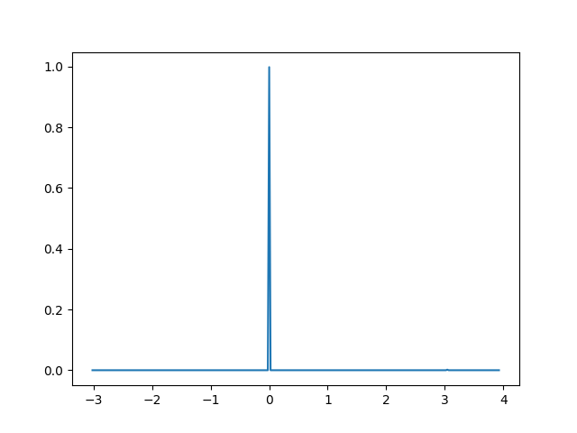
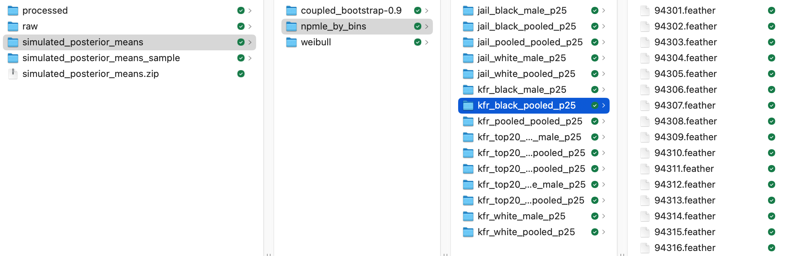

# README for "Empirical Bayes When Estimation Precision Predicts Parameters"
Jiafeng Chen, Stanford University

jiafeng@stanford.edu

MS-22935 for _Econometrica_

This replication package is written with the assistance of GitHub Copilot and Claude Code.

## Quickstart

To regenerate figures and tables _without_ regenerating/re-scoring the Monte Carlo
data, simply run after installation:
```bash
./generate_assets.sh
```
This writes tables and figures to `assets/`

## Overview

The code in this replication package does the following:
1. Cleans raw data from Opportunity Atlas (Chetty et al., 2022)
2. Generate Monte Carlo samples used in the empirical exercises (**Time consuming**;
   pre-computed outputs included in `simulated_posterior_means.zip`)
3. _Scores_ the Monte Carlo - i.e., computes statistics underlying tables and figures in
   the paper
4. Builds figures and tables in the paper from the output of step 3.

For a partial replication, skip step 2 and use the included pre-computed output
(stored in `simulated_posterior_means.zip`; please reach out to jiafeng@stanford.edu if not found).


Three main analysis files
generate all 9 figures (5 in the main text, 4 in the online appendix) and 1 table (online
appendix).

A full replication of the Monte Carlo (step 2) is time-consuming
but extremely parallelizable. See [a note below on parallelism for
details](#parallelism). Full replication is also tricky because of an upstream problem
where long-running Monte Carlos appear to fail silently (see
[NOTE](#note-on-replicating-monte-carlo-data)) - though progress is saved and
restarting a script resumes the progress.  I have included a copy of the generated Monte Carlo output in
(`simulated_posterior_means.zip`; please reach out to jiafeng@stanford.edu if not found).

Specifically, each exercise runs $M$ iterations for $V$ different outcome variables. Right
now the code parallelizes over V but not over M. A rough estimate of time taken is in the
table below (your mileage may vary on time per iteration):

| exercise                       | time per iteration |  # total iterations | V | M | max core | estimated total hours at full parallelization |
| ------------------------------ | ----------: | -----: | ----------: | ------------------: | -------: | --------------------------------------------: |
| Calibrated simulation          |       1 min | 15,000 |          15 |               1,000 |       15 |                                         16.67 |
| Validation (coupled bootstrap) |     \~2 min | 15,000 |          15 |               1,000 |       15 |                                         33.33 |
| Weibull (OA5.3)                |     0.5 min |    600 |           6 |                 100 |        6 |                                          0.83 |
| Additive model (OA5.4)         |     0.5 min |    600 |           6 |                 100 |        6 |                                          0.83 |


In lieu of a full replication of the Monte Carlo generation, each Monte Carlo run can also
be checked separately (things are time-consuming overall because there are a lot of runs).
I provide code for generating specific runs of the Monte Carlo exercise and checking against the data I provided. See
[NOTE](#note-on-replicating-monte-carlo-data).

All code is in Python, but NPMLE estimation relies on the package
`rpy2`, R, and Mosek.

The directory structure is as follows
```
.
├── additive_model.sh                Monte Carlo run for covariate additive model in the appendix (Step 2)
├── assets/                          Final figs/tables; produced by generate_assets.sh
├── assets_appendix.py
├── assets_empirical.py
├── assets_introduction.py
├── build_data.py                    Step 1 script
├── check_monte_carlo.py             Tools for selective verification of step 2
├── conditional_means/               Utilities
├── coupled_bootstrap.sh             Monte Carlo run for coupled bootstrap exercise (Step 2)
├── covariate_additive_model.py
├── data                             Raw data, processed data, and Monte Carlo generated results
├── empirical_bayes                  Library code
├── empirical_exercise.py            Code underlying, e.g., coupled_bootstrap.sh
├── environment.yml                  Python dependencies
├── generate_assets.sh               Step 4 script
├── generate_scores.py               Step 3 script
├── LICENSE.txt
├── logs                             Monte Carlo replication writes logs here
├── monte_carlo.sh                   Monte Carlo run for npmle_by_bins exercise (Step 2)
├── postprocessing                   Library code for scoring and figures
├── README.md
├── renv                             R’s library folder (auto-created)
├── renv.lock                        R dependencies
├── residualize.py                   Library code
├── results                          Output from step 3
├── simulator                        Library code
├── test.png                         test.py output
├── test.py                          Checking Python/R/Mosek installation
├── test.R                           Checking Python/R/Mosek installation
└── weibull_model.sh                 Monte Carlo replication for Weibull exercise in the appendix (Step 2)
```

## Data Availability and Provenance Statements


The data are taken from the published datasets by Chetty et al. (forthcoming) in
Chetty et al. (2022) under CC-BY-4.0. They are available at https://opportunityinsights.org/data/?geographic_level=0&topic=0&paper_id=1652#resource-listing (Accessed
2024-09-16).

### Statement about Rights
[x] I certify that the author(s) of the manuscript have legitimate access
  to and permission to use the data used in this manuscript.

[x] I certify that the author(s) of the manuscript have documented
  permission to redistribute/publish the data contained within this
  replication package. Appropriate permission are documented in the
  [LICENSE](https://social-science-data-editors.github.io/template_README/LICENSE.txt)
  file.

### License for Data
The data are licensed under a CC-BY-4.0 license. See LICENSE.txt for details.

### Summary of Availability
[x] All data **are** publicly available

### Details on each dataset and data source

This package builds from the following raw data files, all from Chetty et al. (2022).
They are downloaded at
https://opportunityinsights.org/data/?geographic_level=0&topic=0&paper_id=1652#resource-listing
(Accessed 2024-09-16).

  - `data/raw/tract_covariates.dta` ("Neighborhood Characteristics by Census
    Tract"):
    https://opportunityinsights.org/wp-content/uploads/2018/10/tract_outcomes_dta.zip
        (Accessed 2024-09-16)

  - `data/raw/tract_outcomes_early.csv` ("All Outcomes by Census Tract,
      Race, Gender and
      Parental Income Percentile"):
  https://opportunityinsights.org/wp-content/uploads/2018/10/tract_outcomes.zip
      (Accessed 2024-09-16)

## Computational requirements and installation instructions

### Option 1 (Docker)
See [Docker instructions](./docker-instructions.md) for using a docker container.

### Option 2 (Source)

This replication package is written in Python, but it requires R and Mosek installations
for certain functions to work. Bash scripts require [GNU
Parallel](https://savannah.gnu.org/projects/parallel/), installed via your package
manager (e.g. `brew install parallel` for Homebrew users). Follow 1-4 below and check the
installation.

**Note: Rmosek is not supported on aarch64 Linux. See [here](https://docs.mosek.com/10.2/rmosek/install-interface.html) for a list of supported platforms**

1. (**Python**) To set up the Python environment, simply use the following
to create an environment called `eb-replication` from the `environment.yml` file. We will
need to activate the environment and work in it at all times.

```bash
# Before running, install conda by installing Anaconda distribution for python
# https://www.anaconda.com/docs/getting-started/anaconda/install
# See  https://docs.conda.io/projects/conda/en/latest/user-guide/tasks/manage-environments.html#creating-an-environment-from-an-environment-yml-file
conda env create -f environment.yml
conda activate eb-replication

## If this didn't work, then a simple fall back is to create an empty environment and then use pip
## Create and activate an empty environment with the correct python version
# conda create -n eb-replication python=3.10
# conda activate eb-replication

## install using pip freshly without loading local cache
# pip install --no-cache-dir -r requirements.txt
```

2. (**Mosek**) The code is last run with [Mosek
10.2.5](https://www.mosek.com/downloads/10.2.5/) (Importantly, I think Mosek 11 introduces
breaking changes for `REBayes` and should be avoided). To use Mosek, one needs to obtain a
[license](https://www.mosek.com/license/request/?i=acp). Follow [Mosek
installation, section 4.2-4.3](https://docs.mosek.com/10.2/install/installation.html) for instructions.


3. (**R**) With an R installation (Last run with R version 4.4.0 (2024-04-24) -- "Puppy Cup"), ensure
that [`renv`](https://rstudio.github.io/renv/articles/renv.html) is installed. Then, in an
R session from the command line, run
```R
renv::restore() # Reads packages from ./renv.lock and installs them
```

4. (**Rmosek**) The last thing to do is to install `Rmosek`. The above should have
   installed the package Rmosek, but it needs to be built manually.
Now, in an R session, if we call `library(Rmosek)` we would expect
```R
> library(Rmosek)

   The Rmosek meta-package is ready. Please call

      mosek_attachbuilder(what_mosek_bindir)

   to complete the installation. See also '?mosek_attachbuilder'.
```

Following the [`Rmosek`
instructions](https://docs.mosek.com/latest/rmosek/install-interface.html), we install
`Rmosek` like so. (Note, after installation, Rmosek's version would disagree with
`renv.lock`. This would cause a warning "- The project is out-of-sync -- use `renv::status()` for details.", but it's safe to ignore.)
```R
# <RMOSEKDIR> is the directory that Mosek is installed in
# e.g., ~/mosek/10.2/tools/platform/osxaarch64/rmosek
source("<RMOSEKDIR>/builder.R")
attachbuilder()
install.rmosek()
# We should get instruction "Please restart the R session for changes to take effect" at the end.
```


### Checking the installation
Here are some tools to check if installation is successful. First, we can run `python -m rpy2.situation` and should expect the following.
```bash
❯ python -m rpy2.situation
rpy2 version:
3.5.16
Python version:
3.9.13 | packaged by conda-forge | (main, May 27 2022, 17:01:00)
[Clang 13.0.1 ]
Looking for R's HOME:
    Environment variable R_HOME: None
    Calling `R RHOME`: /Library/Frameworks/R.framework/Resources
    Environment variable R_LIBS_USER: None
R's value for LD_LIBRARY_PATH:

R version:
    In the PATH: R version 4.4.0 (2024-04-24) -- "Puppy Cup"
    Loading R library from rpy2: OK
Additional directories to load R packages from:
None
C extension compilation:
  include:
  ['/Library/Frameworks/R.framework/Resources/include']
  libraries:
  ['pcre2-8', 'lzma', 'bz2', 'z', 'icucore', 'dl', 'm', 'iconv']
  library_dirs:
  ['/opt/R/arm64/lib', '/opt/R/arm64/lib']
  extra_compile_args:
  ['-std=c99']
  extra_link_args:
  ['-F/Library/Frameworks/R.framework/..', '-framework', 'R']
Directory for the R shared library:
lib
CFFI extension type
  Environment variable: RPY2_CFFI_MODE
  Value: CFFI_MODE.ANY
  ABI: PRESENT
  API: PRESENT
```

Next, we can run `test.py`, which tests core functionality in RPy2, and expect the following:
```
❯ python test.py
- Project '~/Library/CloudStorage/Dropbox/research/empirical-bayes/replication' loaded. [renv 1.1.4]
Call: lprobust

Sample size (n)                              =    1000
Polynomial order for point estimation (p)    =    1
Order of derivative estimated (deriv)        =    0
Polynomial order for confidence interval (q) =    2
Kernel function                              =    Epanechnikov
Bandwidth method                             =    imse-dpi


Call:
	NULL

Data:  ( obs.);	Bandwidth 'bw' =

       x                 y
 Min.   :-3.0196   Min.   :0.000000
 1st Qu.:-1.2831   1st Qu.:0.000000
 Median : 0.4534   Median :0.000000
 Mean   : 0.4534   Mean   :0.003333
 3rd Qu.: 2.1898   3rd Qu.:0.000000
 Max.   : 3.9263   Max.   :0.998168
```

We should also get the following image `test.png`




To isolate whether issues are coming from `RPy2` or the underlying R installation, run
`test.r` and we should expect the following:

```bash
❯ Rscript test.r
Loading required package: Matrix
Warning message:
package ‘nprobust’ was built under R version 4.4.1
Call: lprobust

Sample size (n)                              =    100
Polynomial order for point estimation (p)    =    1
Order of derivative estimated (deriv)        =    0
Polynomial order for confidence interval (q) =    2
Kernel function                              =    Epanechnikov
Bandwidth method                             =    imse-dpi


Call:
	NULL

Data:  ( obs.);	Bandwidth 'bw' =

       x                 y
 Min.   :-2.9932   Min.   :0.000000
 1st Qu.:-1.6732   1st Qu.:0.000000
 Median :-0.3532   Median :0.000000
 Mean   :-0.3532   Mean   :0.003333
 3rd Qu.: 0.9668   3rd Qu.:0.000000
 Max.   : 2.2867   Max.   :0.951492
```

### Controlled Randomness
Random seed is set at:
- Line 181 of `covariate_additive_model.py`
- Line 226 of `empirical_exercise.py`

Note: `REBayes::GLmix` uses `REBayes::KWDual` to interact with an underlying Mosek
optimizer. This optimizer may introduce additional randomness which I do not control. As
far as I am aware, there is no option to seed this randomness in `REBayes`.

### Memory, Runtime, Storage Requirements

- <10 minutes (Reproducing from scored Monte Carlo outputs - i.e. starting from step 4 below)
- 10-60 minutes (Reproducing from Monte Carlo outputs - i.e., starting from step 3 below)
- 1-3 days (Full reproduction - i.e., starting from step 1 or step 2 below)

The code was last run on a 2022 Mac Studio, 32GB RAM, Apple M1 Max.


## Description of programs/code and instruction to replicators

### Overview
The replication process is modularized as follows. Each step saves output to the disk that
the next step depends on. These outputs are included in the replication package
transmitted to the data editor, and so **partial replications can start from any step**. For
instance, directly going to step 4 generates all tables and figures.

(**Step 1 - Raw data cleaning**) `build_data.py` performs basic cleaning on the raw
Opportunity Atlas data and saves the processed data in
`data/processed/oa_data_used.feather`. The rest of the analysis proceeds only
with `data/processed/oa_data_used.feather`.

(**Step 2 - Monte Carlo data generation**) Most empirical exercises in the paper aggregate over
simulation draws that depend on the cleaned data. These simulation draws---which we refer
to as the _Monte Carlo data_---are directly saved in
`data/simulated_posterior_means/`. The subsequent analysis only depends on the
generated Monte Carlo data. **This step is time consuming and error-prone: For a partial
replication, one could directly proceed from the next step or step 4, without re-generating the
Monte Carlo data (pre-computed Monte Carlo data from a previous run should be included in this
replication package - contact jiafeng@stanford.edu if not).**

One could also selectively verify subsets of the output generated by
this step, as opposed to regenerating every simulation run: For instance,
```python
# Selective verification of `data/simulated_posterior_means/npmle_by_bins/kfr_top20_black_pooled_p25/94682.feather` (94682=94301+381)
python check_monte_carlo.py --simulator_name npmle_by_bins --est_var kfr_top20_black_pooled_p25  --seed_number 381
```

See [NOTE](#note-on-replicating-monte-carlo-data) below for
detailed instructions.

The Monte Carlo data are generated by the following bash scripts:
  - `./monte_carlo.sh` runs the calibrated simulation exercise
  - `./coupled_bootstrap.sh` runs the coupled bootstrap exercise
  - `./weibull_model.sh` runs the Weibull distribution exercise in online appendix
  - `./additive_model.sh` runs an additional model exercise in online appendix

(**Step 3 - Computations on the Monte Carlo data whose output underlies the figures**) Various
statistics underlying tables and figures are computed on the Monte Carlo data (We call
this _scoring_ the Monte Carlo data).
`./generate_scores.py` takes Monte Carlo results in
`data/simulated_posterior_means/` and scores them. It saves results in
`results/[SimulatorName]/*.csv`, where `SimulatorName` is one of {`coupled_bootstrap-0.9`,
`covariate_additive_model`, `npmle_by_bins`, `weibull`}

(**Step 4 - Tables and figures**) Finally, the tables and figures are generated directly
from the output of the last step. How each table/figure links to each python script is
detailed below. `generate_assets.sh` simply runs all of them.

**Note on figure output:** Figures with many scatter points (Figures 1-3) are saved in both PDF and PNG formats. PDF files use rasterized scatter points for smaller file sizes but may display inconsistently across PDF viewers (e.g., missing points in Chrome, artifacts in Preview). PNG files provide reliable viewing across all platforms.

| Content                     | Script                   |
|------------------------------------------|--------------------------|
| Figures 1–3                              | `./assets_introduction.py` |
| Footnote 6 voice over                          | `./assets_introduction.py` |
| Figures 4–5                              | `./assets_empirical.py`    |
| Table OA5.1                              | `./assets_appendix.py`     |
| Figures OA5.1–OA5.4                      | `./assets_appendix.py`     |

#### Lower-level files and additional dependencies
These steps depend on the following lower-level files:
1. `empirical_exercise.py` samples either calibrated Monte Carlo simulation or coupled
   bootstrap simulation. It then computes various posterior mean estimates using various
   empirical Bayes or non-empirical Bayes methods. The `.sh` files in Step 2 are
   essentially wrappers that call `empirical_exercise.py`.

2. `covariate_additive_model.py` runs CLOSE-NPMLE with a flexible additive model for
   covariates. This is only relevant for `./additive_model.sh`

3. Helpers:
-  `residualize.py` implements linear residualization by covariates
- `conditional_means/` contains methods for estimating conditional means
- `empirical_bayes/` contains methods for implementing empirical Bayes methods
- `postprocessing/` contains methods for computing various metrics and visualization
- `simulator/` contains code for implementing various methods for simulation synthetic data from
raw data

### Instructions to replicators

Below are code snippets for reproducing each step described in the list
above.
**I recommend starting with Steps 3 or 4 to check if everything replicates given the Monte
Carlo output.** Run all code from the top level of the directory.

The Monte Carlo output should be included as `simulated_posterior_means.zip` (please contact jiafeng@stanford.edu if
not). This file can be unzipped into `data/`, where `data/simulated_posterior_means/`
should include three directories `coupled_bootstrap-0.9`, `npmle_by_bins`, and `weibull`.
Each of these three directories should then contain subdirectories with variable names like
`kfr_black_male_p25`. There should be 1000 or 100 `.feather` files in these directories,
with number names:



A full replication of Step 2
is time-consuming, but selective subsets of the output can be checked easily.

#### Step 0: Change permissions
Run `chmod +x *.sh` to allow the .sh files to be run as executables. Alternatively one may
run `bash script.sh` to execute them.

#### Step 1: Raw data cleaning
```python
# Builds the raw analysis dataset from raw data
python build_data.py
```

#### Step 2: Monte Carlo data generation

The following bash commands runs each bash script and generates the Monte Carlo data.

This is the most
time-consuming and error-prone step (see [NOTE](#note-on-replicating-monte-carlo-data) below): The output of this step is included in the replication
package directly. Moreover, optionally, instead of fully replicating this step, one could verify a small subset of
the Monte Carlo data. The [NOTE](#note-on-replicating-monte-carlo-data) below includes instructions for doing so.

```bash
# Run the Monte Carlo
# The following generates results/[simulator-name]
# where [simulator-name] is one of "coupled_bootstrap-0.9",
# "covariate_additive_model", "npmle_by_bins", "weibull"

rm -f logs/*          # Clear logs

# -----------------------------------------------------------------------------
# Time consuming, the progress bar is written to std.err, which is written to logs/.
# Can check corresponding files in logs/ to monitor

# (monte_carlo.sh coupled_bootstrap.sh weibull_model.sh) do not need to be run sequentially.
# They can be run concurrently

# With &, scripts run in the background of the terminal session. It prints a pid,
# use `ps -p [pid]` to check and `kill [pid]` to kill if necessary.

# ------------------------------------------------
# Calibrated simulation exercise
# Time estimate: (1 minute per iteration x 15000 iterations) / min(#cores, 15)
NUM_CORES=15 ./monte_carlo.sh &     # To monitor: tail -F logs/mc_error*

# Validation exercise using coupled bootstrap
# Time estimate: (~2 minute per iteration x 15000 iterations) / min(#cores, 15)
NUM_CORES=15 ./coupled_bootstrap.sh &  # To monitor: tail -F logs/error_*

# Weibull exercise in OA5.3
# Time estimate: (0.5 minute per iteration x 600 iterations) / min(#cores, 6)
NUM_CORES=6 ./weibull_model.sh &   # To monitor: tail -F logs/weibull_error*

# Monitor the progress of everything by counting files in the output directory
# data/simulated_posterior_means
./monitor.sh

# -----------------------------------------------------------------------------
# Additive model exercise in OA5.4
# ***ASSUMES the output from coupled_bootstrap.sh already exists***
# Saves results directly in results/covariate_additive_model/*.csv
# Time estimate: (0.5 minute per iteration x 600 iterations) / min(#cores, 6)
NUM_CORES=6 ./additive_model.sh &  # To monitor: tail -F logs/cam_error*
```

#### Step 3: Computing table/figure-relevant statistics

```bash
### Assumes that data/simulated_posterior_means/ is populated,
### either because Step 2 is run or because the included Monte Carlo
### output simulated_posterior_means.zip is unzipped.

# Clean up the generated raw Monte Carlo results
python generate_scores.py --simulator-name coupled_bootstrap-0.9 --nsim 1000 # ~20 minutes
python generate_scores.py --simulator-name npmle_by_bins --nsim 1000         # ~1.5 minute
python generate_scores.py --simulator-name weibull --nsim 100                # ~5 seconds
# The additive model results are scored directly in additive_model.sh
```

#### Step 4: Creating tables and figures

```bash
# Generate figures and tables in assets/
# Assumes results/ is correctly populated with scored outputs

./generate_assets.sh
```
---
#### <a name="parallel"></a> Parallelism

The .sh files in step 2 runs the following script in parallel **over `est_var`**
```bash
# Generates draws over seeds 94301 - (94301+nsim-1) for simulator [simulator] and outcome variable [est_var]. See table below for combinations of these arguments
python empirical_exercise.py
--simulator-name [simulator-name] \
--methods [methods-for-simulator] \
--nsim [nsim-for-simulator] \
--starting_seed 94301 \
--est_var [est_var]
```
Across the various empirical exercises, `est_var` ranges over 6 to 15 choices. As a
result, we would only benefit from at most 15 cores.

Alternatively, one could further parallelize by running, e.g., the following in parallel.
This would parallelize within a single `est_var`.
```bash
# Runs seeds 94301-94800
python empirical_exercise.py --simulator-name [simulator-name]  --methods [methods-for-simulator] --nsim 500 --starting_seed 94301 --est_var [est_var]

# Runs seeds 94801-95300
python empirical_exercise.py --simulator-name [simulator-name]  --methods [methods-for-simulator] --nsim 500 --starting_seed 94801 --est_var [est_var]
```

Doing so is a little memory inefficient because runs using the same `est_var` share
underlying data.


| Simulator name | Outcome variable names | Seed range | Methods |
|-------|----------|------|---|
| `coupled_bootstrap-0.9` | One of `("kfr_pooled_pooled_p25"  "kfr_white_male_p25"  "kfr_black_male_p25"  "kfr_black_pooled_p25" "kfr_white_pooled_p25" "jail_black_male_p25" "jail_white_male_p25" "jail_black_pooled_p25" "jail_white_pooled_p25" "jail_pooled_pooled_p25" "kfr_top20_black_male_p25" "kfr_top20_white_male_p25" "kfr_top20_black_pooled_p25" "kfr_top20_white_pooled_p25" "kfr_top20_pooled_pooled_p25")` | 94301-95300 | `all`
| `npmle_by_bins` | One of `("kfr_pooled_pooled_p25"  "kfr_white_male_p25"  "kfr_black_male_p25"  "kfr_black_pooled_p25" "kfr_white_pooled_p25" "jail_black_male_p25" "jail_white_male_p25" "jail_black_pooled_p25" "jail_white_pooled_p25" "jail_pooled_pooled_p25" "kfr_top20_black_male_p25" "kfr_top20_white_male_p25" "kfr_top20_black_pooled_p25" "kfr_top20_white_pooled_p25" "kfr_top20_pooled_pooled_p25")` | 94301-95300 | `all`
| `weibull` | One of `("kfr_pooled_pooled_p25"  "kfr_black_pooled_p25"  "jail_black_pooled_p25" "jail_pooled_pooled_p25" "kfr_top20_black_pooled_p25" "kfr_top20_pooled_pooled_p25")` | 94301 - 94400 | `indep_gauss,close_npmle,close_gauss,close_gauss_parametric`|

---
---
#### <a name="note"></a> NOTE: on replicating Monte Carlo data


For some upstream reason having to do with MOSEK or REBayes, running monte_carlo.sh for many
iterations might silently fail, due to a memory leak. When it fails, the code would appear to run but
resource consumption is low and no new output is generated. Interrupting the code prints `Segmentation
fault`. I find it quite difficult to reproduce the issue, as there's no fixed data seed causing a problem.
When this happens, interrupting and restarting resolves the issue. This has only happened when I
repeatedly apply NPMLE to sample new data and to estimate various methods.

Each Monte Carlo draw results in a file of the form
```
data/simulated_posterior_means/[SimulatorName]/[VariableName]/[Seed].feather.
```

It is not time-consuming to regenerate and verify a given file - the _number_ of these files makes
it time-consuming overall. I have included a script that generates a new Monte Carlo draw
for a particular seed `seed_number` and a particular outcome variable `est_var`

```bash
# See the table below for valid options for --est_var and --simulator_name
# --est_var: Outcome variable being P(top 20 | Black, pooled, parents at 25th percentile)
# --seed_number: The seed used is 94301 + (seed_number mod seed_range). In this case we check seed 94682
# --simulator_name: Simulator name = npmle_by_bins, coupled_bootstrap-0.9, weibull

python check_monte_carlo.py --est_var kfr_top20_black_pooled_p25  --seed_number 381 --simulator_name npmle_by_bins
```


`check_monte_carlo.py` works by generating a specific draw of the Monte Carlo data, saves
it in `data/simulated_posterior_means_sample`, and compares it against its counterpart in
`data/simulated_posterior_means`. I have found that different hardware/version would only agree up
to something like `1e-6`, and so I check agreement between two files by regressing one on
the other. A typical output is as follows across two machines - the regression fit is
essentially perfect.

```
- Project '~/Library/CloudStorage/Dropbox/research/empirical-bayes/replication' loaded. [renv 1.1.4]
- The project is out-of-sync -- use `renv::status()` for details.
Checking Monte Carlo outputs...
kfr_top20_black_pooled_p25: 100%|███████████████████████████████████████████████████████████████████████████████████████████| 1/1 [00:00<00:00, 14315.03it/s]
--------------------------------------------------
Seed: 94682
Outcome variable: kfr_top20_black_pooled_p25
Simulator name: npmle_by_bins
Correlation between original and new Monte Carlo samples
(some differences may exist due to hardware or version):
--------------------------------------------------
                              Correlation     Intercept  Regression Coef
naive                            1.000000 -1.370503e-07         1.000000
indep_npmle                      0.999999  5.062243e-07         0.999980
indep_gauss                      1.000000  1.034661e-06         0.999973
close_npmle                      1.000000 -8.168789e-08         1.000002
close_gauss                      1.000000  1.060407e-07         0.999997
close_gauss_parametric           1.000000  3.004981e-07         0.999993
oracle                           1.000000 -2.953876e-07         1.000003
truth                            1.000000 -2.181302e-07         1.000002
indep_npmle_nocov                1.000000 -4.812911e-07         1.000013
indep_gauss_nocov                0.999999 -5.065023e-07         1.000019
close_npmle_nocov                1.000000 -1.943102e-07         1.000002
close_gauss_nocov                1.000000 -1.923112e-07         1.000001
close_gauss_parametric_nocov     1.000000 -1.189520e-07         1.000000
true_covariate_fn                1.000000 -2.741553e-14         1.000000
truth_residualized               1.000000 -2.106331e-07         1.000003
--------------------------------------------------
```


## References
Chetty, Raj, John Friedman, Nathaniel Hendren, Maggie R. Jones, and Sonya R. Porter,
“Replication Data for: The Opportunity Atlas: Mapping the Childhood Roots of Social
Mobility,” 2022.

Chetty, Raj, John Friedman, Nathaniel Hendren, Maggie R. Jones, and Sonya R. Porter, “The opportunity
atlas: Mapping the childhood roots of social mobility,” American Economic Review,
forthcoming.

O. Tange (2018): GNU Parallel 2018, March 2018, https://doi.org/10.5281/zenodo.1146014.
